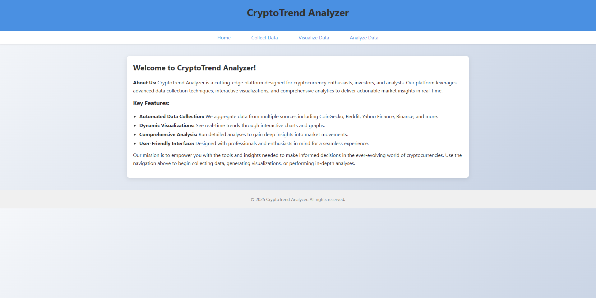
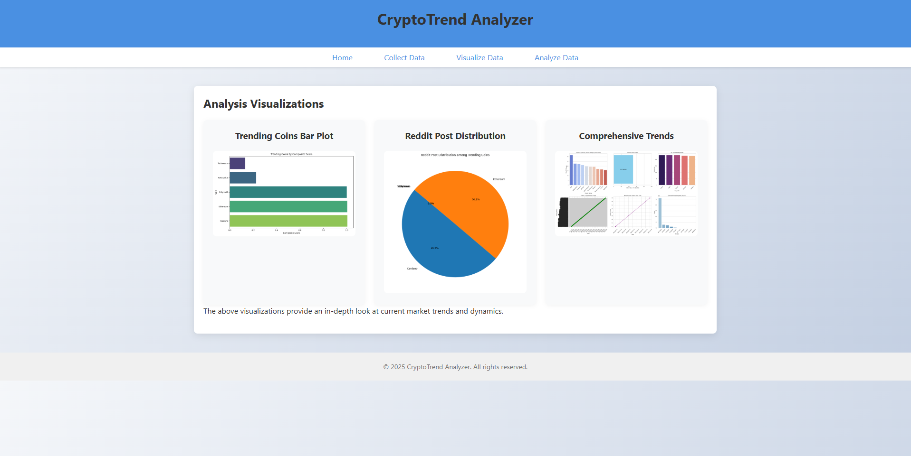

# CryptoTrend Analyzer

CryptoTrend Analyzer is a tool for collecting, processing, and analyzing cryptocurrency data from multiple sources. It gathers information from APIs such as Binance, CoinGecko, the Fear & Greed Index, Yahoo Finance, Reddit, and various news outlets to provide insights on market trends and sentiment.

## Features

- **Data Collection:**
  - Collects price data from Binance.
  - Retrieves market data from CoinGecko.
  - Fetches the Fear & Greed Index.
  - Obtains news articles related to cryptocurrencies.
  - Extracts Reddit posts and trending keywords.
  - Collects Yahoo Finance cryptocurrency data.

- **Data Processing:**
  - Preprocesses and cleans raw data for analysis.
  - Merges data from multiple sources when necessary.

- **Visualization:**
  - Generates various visualizations (bar plots, line charts, pie charts) to showcase trends.
  - Displays multi-panel dashboards for comprehensive trend analysis.

- **Analysis:**
  - Supports exploratory data analysis to derive meaningful insights.

- **Data Storage (Optional):**
  - Supports storing processed data in MongoDB.


## Homepage Preview

Here is a preview of the **homepage** of the CryptoTrend Analyzer:



## Analysis Page Preview

Here is a preview of the analysis page, showcasing the visualizations generated by the platform:




## Project Structure

CryptoTrend Analyzer/
├── backend/               # Backend scripts for data collection and processing
│   ├── analysis.py           # Data analysis scripts
│   ├── collect_binance.py    # Collects Binance data
│   ├── collect_coingecko.py  # Collects CoinGecko data
│   ├── collect_fear_greed.py # Collects Fear & Greed Index data
│   ├── collect_news.py       # Collects news articles
│   ├── collect_reddit.py     # Collects Reddit posts
│   ├── collect_yahoo.py      # Collects Yahoo Finance data
│   ├── eda.py                # Exploratory data analysis scripts
│   ├── preprocess_data.py    # Preprocesses raw data for analysis
│   ├── store_mongodb.py      # Stores data in MongoDB
│   └── visualization.py      # Generates visualizations
├── data/                  # Contains raw, processed, and visualization data
│   ├── raw/               # Raw data collected from APIs
│   ├── processed/         # Processed data ready for analysis
│   ├── preprocessed/      # Data after cleaning and preprocessing
│   ├── combined/          # Combined datasets (if applicable)
│   └── visualizations/    # Saved visualizations (PNG files, etc.)
├── frontend/              # Frontend files for the web interface
│   └── app.py                # Flask application for the web interface
├── templates/             # HTML templates for the Flask frontend
├── images/                # Images used in the project or generated by the app
├── config.py              # Configuration file for paths and API credentials
├── requirements.txt       # Required Python packages
├── README.md              # Project overview and instructions
└── main.py                # Main entry point for the application

## Installation

1. **Clone the Repository:**

   ```bash
   git clone https://github.com/zanMark00/CryptoTrend-Analyzer.git
   cd CryptoTrend-Analyzer
   ```

2. **Create a Virtual Environment:**

   ```bash
   python -m venv venv
   source venv/bin/activate  # On macOS/Linux
   # For Windows (Command Prompt):
   # venv\Scripts\activate
   # For Windows (PowerShell):
   # .\venv\Scripts\Activate.ps1
   ```

3. **Install Dependencies:**

   ```bash
   pip install -r requirements.txt
   ```

4. **Configure API Keys**

   In the `config.py` file, locate the placeholders for API keys (for example, `"your_reddit_client_id"`, `"your_newsapi_key"`, etc.) and replace them with your actual API credentials. This step is critical before running the application so that it can successfully communicate with the external APIs.

## Usage

1. **Running the Backend**

To run the entire application, simply execute:

    ```bash
    python main.py
    ```

2. **Running the Frontend**

    ```bash
    cd frontend
    python app.py
    ```
  
Once the application is running, open your browser and navigate to http://127.0.0.1:8502 to access the platform.

